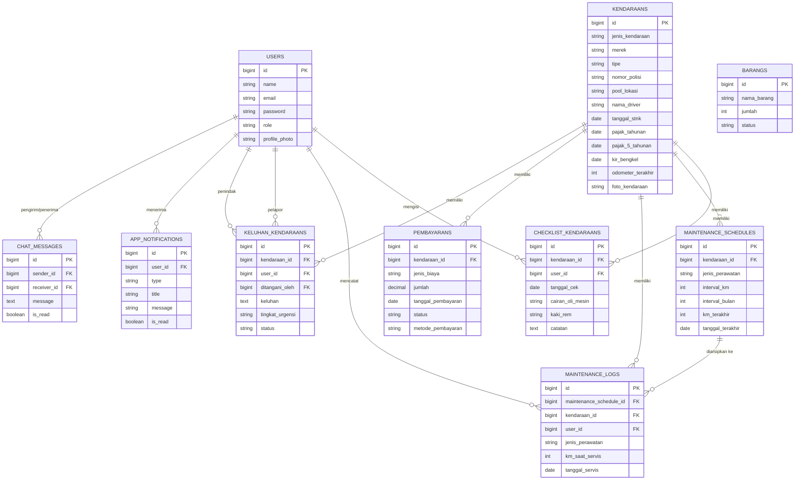
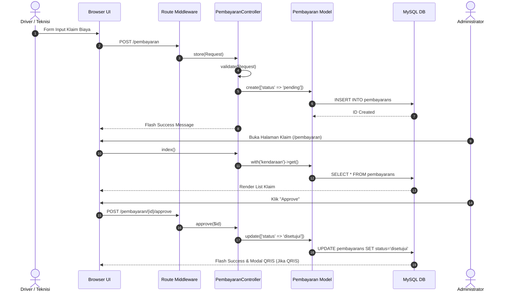
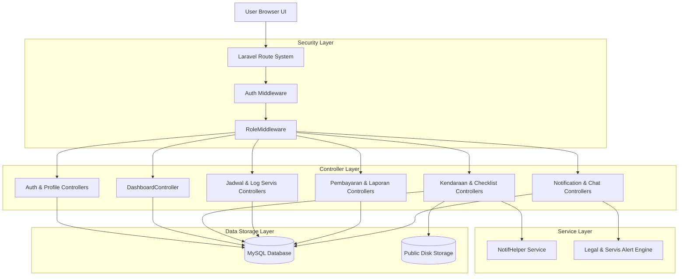
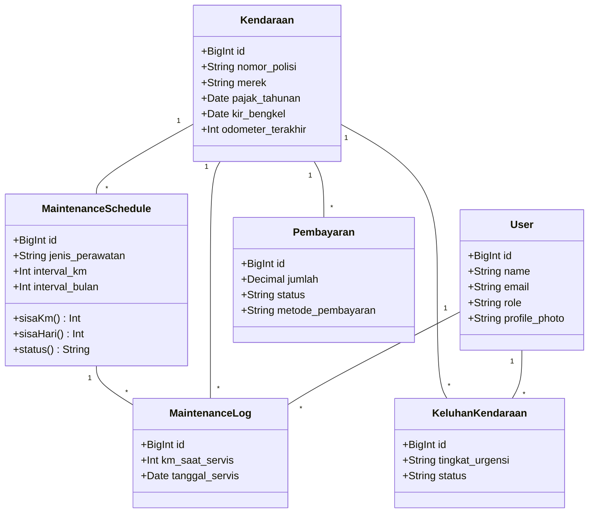

# Dokumentasi & Analisis Arsitektur Sistem Manajemen Perawatan Armada

**Nama Aplikasi**: Sistem Manajemen Perawatan Armada (Fleet Maintenance System)  
**Framework**: Laravel  
**Versi Dokumen**: 1.0  
**Tanggal Audit**: 12 Agustus 2026  

---

## Daftar Isi
1. [Ringkasan Eksekutif & Fitur Utama](#1-ringkasan-eksekutif--fitur-utama)
2. [Penjelasan Struktur Folder Proyek](#2-penjelasan-struktur-folder-proyek)
3. [Penjelasan Process Bisnis Utama](#3-penjelasan-process-bisnis-utama)
4. [Analisis Modul-demi-Modul (11 Modul)](#4-analisis-modul-demi-modul)
   - [Modul A: Otentikasi & Profil (Auth & Profile)](#modul-a-otentikasi--profil-auth--profile)
   - [Modul B: Dashboard Sistem (Unified Dashboard)](#modul-b-dashboard-sistem-unified-dashboard)
   - [Modul C: Manajemen Armada / Kendaraan](#modul-c-manajemen-armada--kendaraan)
   - [Modul D: Inspeksi Pre-Trip (Checklist Harian)](#modul-d-inspeksi-pre-trip-checklist-harian)
   - [Modul E: Jadwal Perawatan & Riwayat Servis (Scheduled Maintenance)](#modul-e-jadwal-perawatan--riwayat-servis-scheduled-maintenance)
   - [Modul F: Pelaporan Keluhan Kendaraan (Issue Reporting)](#modul-f-pelaporan-keluhan-kendaraan-issue-reporting)
   - [Modul G: Klaim & Pembayaran Biaya Operasional (Expenses & Reimbursement)](#modul-g-klaim--pembayaran-biaya-operasional-expenses--reimbursement)
   - [Modul H: Laporan Analitik Akhir Bulan (Analytics & Reporting)](#modul-h-laporan-analitik-akhir-bulan-analytics--reporting)
   - [Modul I: Pusat Notifikasi Sistem (Notifications)](#modul-i-pusat-notifikasi-sistem-notifications)
   - [Modul J: Manajemen Aset / Barang (Asset Management)](#modul-j-manajemen-aset--barang-asset-management)
   - [Modul K: Komunikasi Chat Driver - Manager](#modul-k-komunikasi-chat-driver---manager)
5. [Diagram Arsitektur & UML (Mermaid)](#5-diagram-arsitektur--uml-mermaid)
   - [Diagram ERD (Entity Relationship Diagram)](#diagram-erd-entity-relationship-diagram)
   - [Diagram Sequence (Klaim Biaya & Persetujuan)](#diagram-sequence-klaim-biaya--persetujuan)
   - [Diagram Komponen System](#diagram-komponen-system)
   - [Diagram Class (Domain Models)](#diagram-class-domain-models)
6. [Analisis Keamanan (Security Audit)](#6-analisis-keamanan-security-audit)
7. [Analisis Kualitas Kode (Code Quality)](#7-analisis-kualitas-kode-code-quality)
8. [Rekomendasi Refactoring](#8-rekomendasi-refactoring)
9. [Fakta Kode vs Konfirmasi yang Diperlukan](#9-fakta-kode-vs-konfirmasi-yang-diperlukan)

---

## 1. Ringkasan Eksekutif & Fitur Utama

Sistem Manajemen Perawatan Armada adalah aplikasi berbasis Laravel yang dirancang untuk mengelola pemeliharaan kendaraan operasional, pelacakan dokumen kelayakan (STNK, Pajak Tahunan, Pajak 5 Tahunan, KIR), inspeksi harian pra-perjalanan (*pre-trip inspection*), pengajuan klaim biaya operasional, hingga pelaporan keluhan teknis.

### Fitur Utama Sistem:
- **Role-Based Access Control (RBAC)**: Otorisasi bertingkat untuk Administrator, Teknisi, Driver, Manager, dan User umum.
- **Dynamic Fleet Health Indicator**: Penilaian status kesehatan armada secara real-time dengan pengkodean warna visual (🟢 Hijau = Aman, 🟡 Kuning = Mendekati Jatuh Tempo, 🔴 Merah = Jatuh Tempo / Overdue).
- **Pre-trip Inspection Checklist**: Form inspeksi harian 13 parameter fisik kendaraan (Cairan, Kaki-kaki, Kelistrikan, Kebersihan).
- **Scheduled Maintenance Tracking**: Manajemen 10 item komponen perawatan berkala (Oli, Aki, Ban, Rem, dll) berbasis sisa KM dan sisa hari dengan otomatisasi pengarsipan ke tabel riwayat.
- **Operational Expense & Reimbursement**: Pengajuan klaim biaya BBM/Servis/Tol dengan alur persetujuan Admin serta opsi pemicu QRIS.
- **Monthly Analytics & Reporting**: Dasbor laporan analitik pengeluaran BBM dan perbaikan armada bulan berjalan untuk mendeteksi unit terboros atau termahal.
- **Unified Notification Hub**: Notifikasi otomatis hasil agregasi dokumen legalitas & jadwal perawatan dipadu dengan notifikasi event aplikasi.
- **Internal Driver-Manager Chat**: Fitur perpesanan langsung berbasis polling untuk komunikasi kelancaran tugas armada.

---

## 2. Penjelasan Struktur Folder Proyek

```text
manajemen_perawatan/
├── app/
│   ├── Helpers/
│   │   └── NotifHelper.php           # Helper terpusat pembentukan record notifikasi
│   ├── Http/
│   │   ├── Controllers/              # 12 Controller logika aplikasi
│   │   │   ├── AuthController.php
│   │   │   ├── BarangController.php
│   │   │   ├── ChatController.php
│   │   │   ├── ChecklistKendaraanController.php
│   │   │   ├── DashboardController.php
│   │   │   ├── JadwalPerawatanController.php
│   │   │   ├── KeluhanKendaraanController.php
│   │   │   ├── KendaraanController.php
│   │   │   ├── LaporanController.php
│   │   │   ├── NotificationController.php
│   │   │   ├── PembayaranController.php
│   │   │   ├── PendaftaranController.php
│   │   │   ├── ProfileController.php
│   │   │   └── StatusArmadaController.php
│   │   └── Middleware/
│   │       └── RoleMiddleware.php    # Middleware pemeriksaan otorisasi role
│   └── Models/                       # 11 Eloquent Model
│       ├── AppNotification.php
│       ├── Barang.php
│       ├── ChatMessage.php
│       ├── ChecklistKendaraan.php
│       ├── KeluhanKendaraan.php
│       ├── Kendaraan.php
│       ├── MaintenanceLog.php
│       ├── MaintenanceSchedule.php
│       ├── Pembayaran.php
│       ├── Pendaftaran.php
│       └── User.php
├── database/
│   └── migrations/                   # 21 Migration file pembentuk skema DB
├── routes/
│   ├── api.php                       # Endpoint API tambahan
│   └── web.php                       # Seluruh rute aplikasi (30+ route)
└── resources/
    └── views/                        # Blade Templates UI
```

---

## 3. Penjelasan Process Bisnis Utama

1. **Pemeriksaan Pre-Trip Harian**: Sebelum armada beroperasi, Driver mengisi inspeksi fisik harian di halaman checklist. Sistem mengirimkan notifikasi ke Admin & Teknisi jika ada temuan.
2. **Pelaporan Keluhan Kendala**: Jika armada mengalami gejala kerusakan, Driver membuat laporan keluhan (ringan/sedang/berat). Notifikasi otomatis dikirim ke Admin/Manager, dan Teknisi menindaklanjuti statusnya dari `baru` -> `diproses` -> `selesai`.
3. **Perawatan Rutin & Log Riwayat**: Sistem mengevaluasi odometer dan tanggal servis terakhir. Saat item komponen diganti, Teknisi memperbarui tanggal/KM terakhir, dan data lama secara otomatis diarsipkan ke `maintenance_logs`.
4. **Pengajuan & Approval Biaya Operasional**: Biaya BBM, tol, atau servis diajukan oleh Driver/Teknisi. Administrator meninjau dan mengubah status menjadi `disetujui` atau `ditolak`.
5. **Analitik Akhir Bulan**: Di akhir bulan, Admin meninjau laporan analitik untuk melihat efisiensi BBM dan total pengeluaran perbaikan armada.

---

## 4. Analisis Modul-demi-Modul

### Modul A: Otentikasi & Profil (Auth & Profile)
1. **Tujuan Module**: Mengelola registrasi pengguna, otentikasi login/logout multi-role, serta manajemen profil dan foto pengguna.
2. **Alur Bisnis**: Pengguna mendaftar/login -> Sistem mengecek kredensial & auto-generate akun bawaan (Admin/Teknisi/Driver) jika belum ada -> Pengguna mendapatkan akses role -> Pengguna dapat memperbarui nama & foto profil.
3. **Route yang Digunakan**:
   - `GET /register` (`register`)
   - `POST /register` (`register.post`)
   - `GET /login` (`login`)
   - `POST /login` (`login.post`)
   - `POST /logout` (`logout`)
   - `GET /profile` (`profile.show`)
   - `POST /profile` (`profile.update`)
4. **Controller yang Menangani**: `AuthController`, `ProfileController`
5. **Request Validation**:
   - Register: `name` (req, string), `email` (req, email, unique:users), `password` (req, min:8, confirmed), `role` (req, in:admin,teknisi,user).
   - Login: `email` (req, email), `password` (req, string).
   - Profile: `name` (req, string), `profile_photo` (nullable, image, max:2048).
6. **Service yang Dipanggil**: Auth facade, Storage disk public.
7. **Repository atau Model yang Digunakan**: `User`
8. **Tabel Database yang Diakses**: `users`
9. **Relasi antar Tabel**: `users` (1) ke (N) `checklist_kendaraans`, `maintenance_logs`, `keluhan_kendaraans`, `app_notifications`, `chat_messages`.
10. **Response yang Dikembalikan**: `view('auth.login')`, `view('auth.register')`, `view('auth.profile')`, `redirect()->route('dashboard')`.

---

### Modul B: Dashboard Sistem (Unified Dashboard)
1. **Tujuan Module**: Menyajikan ringkasan eksekutif kesehatan armada, klaim pengeluaran, serta antarmuka khusus sesuai role pengguna.
2. **Alur Bisnis**: Sistem mengalkulasi status kelayakan kendaraan -> Menampilkan view spesifik (Driver: unit siap/rawat; Teknisi: keluhan & jadwal servis; Admin: chart biaya & aktivitas terbaru).
3. **Route yang Digunakan**: `GET /` (`dashboard`)
4. **Controller yang Menangani**: `DashboardController`
5. **Request Validation**: Tidak ada (Read-only view).
6. **Service yang Dipanggil**: Calculation Engine via Carbon.
7. **Repository atau Model yang Digunakan**: `Kendaraan`, `KeluhanKendaraan`, `MaintenanceSchedule`, `Pembayaran`, `ChecklistKendaraan`.
8. **Tabel Database yang Diakses**: `kendaraans`, `keluhan_kendaraans`, `maintenance_schedules`, `pembayarans`, `checklist_kendaraans`, `users`.
9. **Relasi antar Tabel**: Eloquent Eager Loading (`with`).
10. **Response yang Dikembalikan**: `view('dashboard-driver')`, `view('dashboard-teknisi')`, `view('dashboard')`.

---

### Modul C: Manajemen Armada / Kendaraan
1. **Tujuan Module**: Mengelola data spesifikasi kendaraan, foto, lokasi pool, driver, kelayakan dokumen (STNK, Pajak, KIR), dan pembaruan odometer.
2. **Alur Bisnis**: Admin mendaftarkan unit armada -> Admin/Teknisi mengupdate data atau odometer -> Sistem menghitung status kesehatan armada (Merah/Kuning/Hijau) secara dinamis.
3. **Route yang Digunakan**:
   - `GET /kendaraan` (`kendaraan.index`)
   - `POST /kendaraan` (`kendaraan.store`) [Role: administrator]
   - `PUT /kendaraan/{id}` (`kendaraan.update`) [Role: administrator, teknisi]
   - `PATCH /kendaraan/{id}/odometer` (`kendaraan.update-odometer`) [Role: administrator, teknisi]
   - `DELETE /kendaraan/{id}` (`kendaraan.destroy`) [Role: administrator]
4. **Controller yang Menangani**: `KendaraanController`, `StatusArmadaController`
5. **Request Validation**:
   - Store/Update: `jenis_kendaraan`, `merek`, `tipe`, `nomor_polisi`, `pool_lokasi`, `nama_driver`, `tanggal_stnk`, `pajak_tahunan`, `pajak_5_tahunan` (req), `kir_bengkel` (nullable|date), `odometer_terakhir` (min:0), `foto_kendaraan` (nullable|image|max:2048).
   - Odometer: `odometer_terakhir` (req|integer|min:0).
6. **Service yang Dipanggil**: Storage disk public (upload & delete file).
7. **Repository atau Model yang Digunakan**: `Kendaraan`
8. **Tabel Database yang Diakses**: `kendaraans`
9. **Relasi antar Tabel**: `kendaraans` (1) ke (N) `maintenance_schedules`, `checklist_kendaraans`, `pembayarans`, `keluhan_kendaraans`, `maintenance_logs`.
10. **Response yang Dikembalikan**: `view('kendaraan.index')`, `redirect()->back()->with('success', ...)`.

---

### Modul D: Inspeksi Pre-Trip (Checklist Harian)
1. **Tujuan Module**: Pencatatan kondisi fisik pra-perjalanan kendaraan mencakup Cairan, Kaki-kaki, Kelistrikan, dan Kebersihan.
2. **Alur Bisnis**: User mengisi 13 item checklist -> Data disimpan -> Sistem memicu notifikasi otomatis ke role Admin & Teknisi.
3. **Route yang Digunakan**:
   - `GET /checklist/create` (`checklist.create`)
   - `POST /checklist` (`checklist.store`)
4. **Controller yang Menangani**: `ChecklistKendaraanController`
5. **Request Validation**: `kendaraan_id` (exists:kendaraans,id), `tanggal_cek` (date), 13 atribut checklist (in:Baik,Perlu Perhatian,Buruk), `catatan` (nullable).
6. **Service yang Dipanggil**: `NotifHelper::kirimKeRole`.
7. **Repository atau Model yang Digunakan**: `ChecklistKendaraan`, `Kendaraan`
8. **Tabel Database yang Diakses**: `checklist_kendaraans`, `kendaraans`, `app_notifications`.
9. **Relasi antar Tabel**: `checklist_kendaraans` belongsTo `kendaraans` & `users`.
10. **Response yang Dikembalikan**: `redirect()->route('dashboard')->with('success', ...)`.

---

### Modul E: Jadwal Perawatan & Riwayat Servis (Scheduled Maintenance)
1. **Tujuan Module**: Menjadwalkan pergantian 10 komponen perawatan berkala dan mengarsipkan log riwayat servis setiap kali pergantian dilakukan.
2. **Alur Bisnis**: Teknisi input aturan interval -> Sistem kalkulasi sisa KM & hari -> Saat pergantian komponen dilakukan, data lama otomatis disalin ke `maintenance_logs` sebelum data jadwal diperbarui.
3. **Route yang Digunakan**:
   - `GET /jadwal-perawatan` (`jadwal-perawatan.index`)
   - `GET /jadwal-perawatan/tambah` (`jadwal-perawatan.create`)
   - `POST /jadwal-perawatan` (`jadwal-perawatan.store`)
   - `PATCH /jadwal-perawatan/{jadwalPerawatan}` (`jadwal-perawatan.update`)
   - `DELETE /jadwal-perawatan/{jadwalPerawatan}` (`jadwal-perawatan.destroy`)
   - `GET /jadwal-perawatan/riwayat` (`jadwal-perawatan.riwayat`)
4. **Controller yang Menangani**: `JadwalPerawatanController`
5. **Request Validation**:
   - Store: `kendaraan_id`, `jenis_perawatan` (req), `interval_km`, `interval_bulan`, `km_terakhir`, `tanggal_terakhir`, `catatan`.
   - Update: Sanitasi input titik/koma pada `km_terakhir`.
6. **Service yang Dipanggil**: Business logic methods pada Model `MaintenanceSchedule` (`sisaKm()`, `sisaHari()`, `status()`).
7. **Repository atau Model yang Digunakan**: `MaintenanceSchedule`, `MaintenanceLog`, `Kendaraan`.
8. **Tabel Database yang Diakses**: `maintenance_schedules`, `maintenance_logs`, `kendaraans`.
9. **Relasi antar Tabel**: `maintenance_schedules` belongsTo `kendaraans`; `maintenance_logs` belongsTo `maintenance_schedules`, `kendaraans`, `users`.
10. **Response yang Dikembalikan**: `view('jadwal-perawatan.index')`, `view('jadwal-perawatan.create')`, `view('jadwal-perawatan.riwayat')`.

---

### Modul F: Pelaporan Keluhan Kendaraan (Issue Reporting)
1. **Tujuan Module**: Menampung kendala teknis dari pelapor, penentuan tingkat urgensi, dan pembaruan status penanganan oleh teknisi.
2. **Alur Bisnis**: Driver melapor keluhan -> Systems mengirim notifikasi ke Admin & Manager -> Teknisi/Admin memperbarui status penanganan (`diproses`/`selesai`).
3. **Route yang Digunakan**:
   - `GET /keluhan-kendaraan` (`keluhan-kendaraan.index`)
   - `GET /keluhan-kendaraan/tambah` (`keluhan-kendaraan.create`)
   - `POST /keluhan-kendaraan` (`keluhan-kendaraan.store`)
   - `PATCH /keluhan-kendaraan/{keluhanKendaraan}` (`keluhan-kendaraan.update`)
4. **Controller yang Menangani**: `KeluhanKendaraanController`
5. **Request Validation**:
   - Store: `kendaraan_id` (exists:kendaraans,id), `keluhan` (req|max:2000), `tingkat_urgensi` (in:ringan,sedang,berat).
   - Update: `status` (in:baru,diproses,selesai), `catatan_penanganan` (nullable).
6. **Service yang Dipanggil**: `NotifHelper::kirimKeRole`.
7. **Repository atau Model yang Digunakan**: `KeluhanKendaraan`, `Kendaraan`.
8. **Tabel Database yang Diakses**: `keluhan_kendaraans`, `kendaraans`, `users`, `app_notifications`.
9. **Relasi antar Tabel**: `keluhan_kendaraans` belongsTo `kendaraans`, `users` (pelapor), `users` (penindak).
10. **Response yang Dikembalikan**: `view('keluhan-kendaraan.index')`, `view('keluhan-kendaraan.create')`, `redirect()->back()`.

---

### Modul G: Klaim & Pembayaran Biaya Operasional (Expenses & Reimbursement)
1. **Tujuan Module**: Pengajuan klaim pengeluaran (BBM, servis, tol), proses persetujuan oleh Admin, dan opsi pembayaran QRIS/Transfer.
2. **Alur Bisnis**: Pengguna input klaim (default: `pending`) -> Admin meninjau -> Jika disetujui, status menjadi `disetujui` (jika metode QRIS, memicu modal QRIS) -> Pengeditan jumlah >= Rp 1.000.000 mengembalikan status ke `pending`.
3. **Route yang Digunakan**:
   - `GET /pembayaran` (`pembayaran.index`)
   - `POST /pembayaran` (`pembayaran.store`)
   - `POST /pembayaran/{pembayaran}/approve` (`pembayaran.approve`) [Role: administrator]
   - `POST /pembayaran/{pembayaran}/reject` (`pembayaran.reject`) [Role: administrator]
   - `GET /pembayaran/{pembayaran}/edit` (`pembayaran.edit`)
   - `PUT /pembayaran/{pembayaran}` (`pembayaran.update`)
   - `DELETE /pembayaran/{pembayaran}` (`pembayaran.destroy`)
4. **Controller yang Menangani**: `PembayaranController`
5. **Request Validation**: `kendaraan_id` (exists:kendaraans,id), `jenis_biaya` (req), `jumlah` (numeric|min:0), `tanggal_pembayaran` (date), `metode_pembayaran` (in:transfer,qris,tunai).
6. **Service yang Dipanggil**: Session Flash Data (`qris_show`, dll).
7. **Repository atau Model yang Digunakan**: `Pembayaran`, `Kendaraan`.
8. **Tabel Database yang Diakses**: `pembayarans`, `kendaraans`.
9. **Relasi antar Tabel**: `pembayarans` belongsTo `kendaraans`.
10. **Response yang Dikembalikan**: `view('pembayaran.index')`, `view('pembayaran.edit')`, `redirect()->back()`.

---

### Modul H: Laporan Analitik Akhir Bulan (Analytics & Reporting)
1. **Tujuan Module**: Visualisasi data pengeluaran BBM dan perbaikan armada bulan berjalan untuk mengidentifikasi unit terboros dan termahal.
2. **Alur Bisnis**: Agregasi query DB pada pengeluaran berstatus `disetujui` bulan ini -> Pemisahan kategori BBM & Bengkel -> Perhitungan frekuensi bengkel -> Render Chart.js visual.
3. **Route yang Digunakan**: `GET /laporan-analitik` (`laporan.index`) [Role: administrator]
4. **Controller yang Menangani**: `LaporanController`
5. **Request Validation**: Tidak ada.
6. **Service yang Dipanggil**: DB Raw Aggregations (`SUM`, `COUNT`).
7. **Repository atau Model yang Digunakan**: `Pembayaran`, `Kendaraan`.
8. **Tabel Database yang Diakses**: `pembayarans`, `kendaraans`.
9. **Relasi antar Tabel**: Eager loading `with('kendaraan')`.
10. **Response yang Dikembalikan**: `view('laporan.index')`.

---

### Modul I: Pusat Notifikasi Sistem (Notifications)
1. **Tujuan Module**: Mengagregasikan notifikasi hasil pemindaian dokumen (STNK/Pajak/KIR/Servis) dan notifikasi event aplikasi.
2. **Alur Bisnis**: Pindai seluruh kendaraan & jadwal -> Buat 1 notifikasi terpadu ringkas per armada yang bermasalah -> Gabungkan dengan record `app_notifications` -> Sajikan via JSON API & halaman UI.
3. **Route yang Digunakan**:
   - `GET /notifikasi` (`notifikasi.index`)
   - `GET /notifikasi/count` (`notifikasi.count`)
   - `GET /notifikasi/list` (`notifikasi.list`)
   - `POST /notifikasi/{id}/read` (`notifikasi.read`)
   - `POST /notifikasi/baca-semua` (`notifikasi.read-all`)
4. **Controller yang Menangani**: `NotificationController`
5. **Request Validation**: Parameter ID via Route.
6. **Service yang Dipanggil**: `NotifHelper`.
7. **Repository atau Model yang Digunakan**: `AppNotification`, `Kendaraan`.
8. **Tabel Database yang Diakses**: `app_notifications`, `kendaraans`, `maintenance_schedules`.
9. **Relasi antar Tabel**: `app_notifications` belongsTo `users`.
10. **Response yang Dikembalikan**: `view('notifikasi.index')`, JSON Response (`count`, `list`).

---

### Modul J: Manajemen Aset / Barang (Asset Management)
1. **Tujuan Module**: Pencatatan inventaris barang/sparepart dan pemantauan kondisinya.
2. **Alur Bisnis**: Pengguna menambah barang -> Pengguna dapat mengubah status kondisi (`Bagus`/`Perlu Perawatan`) atau menghapus barang.
3. **Route yang Digunakan**:
   - `GET /barang` (`barang.index`)
   - `POST /barang` (`barang.store`)
   - `PATCH /barang/{id}/status` (`barang.update-status`)
   - `DELETE /barang/{id}` (`barang.destroy`)
4. **Controller yang Menangani**: `BarangController`
5. **Request Validation**: `nama_barang` (req|string), `jumlah` (integer|min:1), `status` (in:Bagus,Perlu Perawatan).
6. **Repository atau Model yang Digunakan**: `Barang`
7. **Tabel Database yang Diakses**: `barangs`
8. **Response yang Dikembalikan**: `view('barang.index')`, `redirect()->back()`.

---

### Modul K: Komunikasi Chat Driver - Manager
1. **Tujuan Module**: Fasilitas pesan instan antara Driver dan Manager.
2. **Alur Bisnis**: Driver otomatis terhubung ke Manager -> Manager dapat memilih Driver -> Polling periodik mengambil pesan baru -> Penandaan `is_read`.
3. **Route yang Digunakan**:
   - `GET /chat` (`chat.index`)
   - `POST /chat` (`chat.store`)
   - `GET /chat/poll` (`chat.poll`)
   - `GET /chat/unread-count` (`chat.unread-count`)
4. **Controller yang Menangani**: `ChatController`
5. **Request Validation**: `receiver_id` (exists:users,id), `message` (req|string|max:2000).
6. **Repository atau Model yang Digunakan**: `ChatMessage`, `User`.
7. **Tabel Database yang Diakses**: `chat_messages`, `users`.
8. **Response yang Dikembalikan**: `view('chat.index')`, JSON API responses.

---

## 5. Diagram Arsitektur & UML (Mermaid)

### Diagram ERD (Entity Relationship Diagram)


---

### Diagram Sequence (Klaim Biaya & Persetujuan)


---

### Diagram Komponen System


---

### Diagram Class (Domain Models)


---

## 6. Analisis Keamanan (Security Audit)

- **Perlindungan CSRF**: Semua endpoint HTTP POST/PUT/PATCH/DELETE telah dilindungi oleh middleware CSRF.
- **SQL Injection Prevention**: Pembacaan data menggunakan Eloquent ORM dengan prepared parameter binding.
- **Hash Kata Sandi**: Penggunaan `Hash::make()` (Bcrypt) untuk penyimpanan kata sandi.
- **Pemeriksaan Hak Akses (Authorization)**: Pemanfaatan `RoleMiddleware` pada rute sensistif (misal: penambahan armada & approval klaim biaya hanya untuk `administrator`).
- **Catatan Keamanan untuk Dibenahi**:
  - `AuthController::login` memiliki logika pemulihan otomatis kata sandi untuk akun default saat string password tertentu dimasukkan (`admin123`, `teknisi123`, dll). Disarankan dihapus pada lingkungan produksi.
  - Penggunaan `$request->all()` langsung pada `ChecklistKendaraanController::store` disarankan diganti dengan `$request->validated()` untuk pencegahan Mass Assignment.

---

## 7. Analisis Kualitas Kode (Code Quality)

- **Domain Naming Consistency**: Penamaan atribut database dan variabel model sangat konsisten dalam Bahasa Indonesia sesuai domain bisnis perawatan armada.
- **Business Logic Cohesion**: Logika perhitungan status seperti `sisaKm()`, `sisaHari()`, dan `status()` ditempatkan dengan baik pada Model `MaintenanceSchedule`.
- **Pelanggaran DRY (Don't Repeat Yourself)**: Logika kalkulasi status kesehatan armada (Pajak, KIR, Servis) dihitung ulang di 3 tempat terpisah (`KendaraanController`, `DashboardController`, `NotificationController`).

---

## 8. Rekomendasi Refactoring

1. **Ekstraksi Service Class `FleetStatusService`**: Logika kalkulasi kesehatan kendaraan dan tenggat surat disolusikan ke dalam 1 Service Class terpusat di `app/Services/FleetStatusService.php`.
2. **Penerapan Form Request**: Pindahkan aturan validasi inline dari Controller ke dedicated Request Class (`app/Http/Requests/StoreKendaraanRequest.php`, dll).
3. **Penggunaan `$request->validated()`**: Mengganti penulisan `$request->all()` dengan `$request->validated()` pada pembuatan model Eloquent.
4. **Pembersihan Logika Auto-Seeding pada AuthController**: Pindahkan inisialisasi akun bawaan ke Laravel Database Seeder (`database/seeders/DatabaseSeeder.php`).

---

## 9. Fakta Kode vs Konfirmasi yang Diperlukan

### Fakta Kode (Terverifikasi 100% dari Source Code)
- Terdapat 5 peranan utama: `administrator` (juga `admin`), `teknisi`, `driver`, `user`, `manager`.
- Terdapat 11 tabel database utama.
- Pengeditan nominal klaim pembayaran >= Rp 1.000.000 secara otomatis mengubah status pembayaran menjadi `pending`.
- Penggantian komponen pada `JadwalPerawatanController` secara otomatis membuat arsip log di `maintenance_logs`.

### Memerlukan Konfirmasi Tambahan
- **Integrasi Payment Gateway**: Pembayaran QRIS saat ini memicu tampilan modal di UI via flash session, belum terhubung secara asynchronous via Webhook ke Payment Gateway eksternal.
- **Ekspor Laporan**: Fitur laporan menyajikan ringkasan visual chart di UI, tetapi belum menyediakan tombol ekspor fisik PDF/Excel di backend controller.
