# DOKUMENTASI ARSITEKTUR & MODULE SISTEM
## Sistem Manajemen Perawatan Armada (Fleet Maintenance System)

Dokumen ini berisi rincian teknis untuk **11 Module Utama** yang membangun **Sistem Manajemen Perawatan Armada**. Dokumen ini dirancang terstruktur dan diurutkan secara konsisten menggunakan penomoran `1, 2, 3, dst.` pada setiap rincian modul.

---

## ⚡ TABEL HAFALAN CEPAT (CHEAT SHEET MODULE)

| No | Nama Module | Fungsi Utama | Role Pengakses Utama | Controller |
| :-: | :--- | :--- | :--- | :--- |
| **GROUP 1: OTENTIKASI & UTAMA** |
| 1 | **Auth & Profile** | Login, Logout, Registrasi, Update Profil | Semua User | `AuthController`, `ProfileController` |
| 2 | **Dashboard Utama** | Summary KPI, Grafis Kelayakan, Shortcut | Admin, Teknisi, Driver | `DashboardController` |
| **GROUP 2: OPERASIONAL & FLEET** |
| 3 | **Manajemen Armada** | Master Data Kendaraan, KM, Dokumen (STNK/KIR) | Admin & Teknisi | `KendaraanController` |
| 4 | **Pre-Trip Inspection** | Checklist Harian (Cairan, Ban, Kelistrikan, Kebersihan) | Driver & Teknisi | `ChecklistKendaraanController` |
| 5 | **Status Armada** | Real-time Kesiapan Armada (Ready/Servis/Rusak) | Semua User | `StatusArmadaController` |
| **GROUP 3: PEMELIHARAAN & KELUHAN** |
| 6 | **Jadwal & Riwayat Servis** | Servis Berkala (KM/Bulan) & Log Riwayat Servis | Admin & Teknisi | `JadwalPerawatanController` |
| 7 | **Laporan Keluhan** | Pelaporan Kerusakan Fisik oleh Driver & Perbaikan | Driver & Teknisi | `KeluhanKendaraanController` |
| **GROUP 4: KEUANGAN, INVENTARIS & ANALITIK** |
| 8 | **Klaim Biaya Operasional** | Pengajuan & Approval Biaya (BBM, Tol, Service) | Driver, Teknisi, Admin | `PembayaranController` |
| 9 | **Manajemen Aset/Barang** | Stok Spare Part, Alat Bengkel, Kondisi Barang | Admin & Teknisi | `BarangController` |
| 10 | **Laporan & Analitik** | Grafis & Laporan Bulanan (Mobil Terboros/Termahal) | Admin | `LaporanController` |
| 11 | **Notifikasi Peringatan** | Peringatan Jatuh Tempo Servis, STNK, Pajak, KIR | Semua User | `NotificationController` |

---

## 📌 RINCIAN TEKNIS DOKUMENTASI MODULE

### 1. Module Autentikasi & Profil (Auth & Profile)
1. **Tujuan Module**: Mengelola otentikasi login/logout, registrasi akun baru, dan pembaruan foto/data profil pengguna.
2. **Alur Bisnis**: Pengguna Login/Register ➔ Verifikasi Kredensial & Role ➔ Sesi Dibentuk ➔ Akses Fitur Sesuai Role.
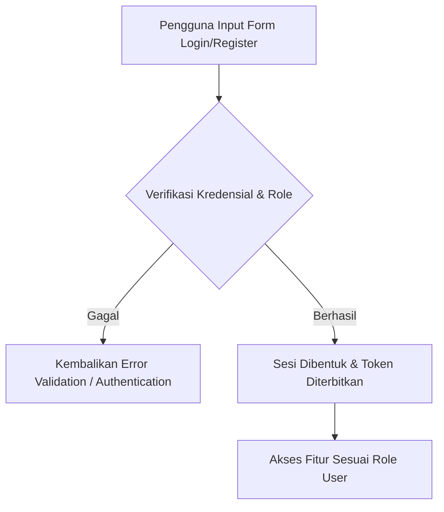
3. **Route yang Digunakan**: `GET/POST /login`, `GET/POST /register`, `POST /logout`, `GET/POST /profile`
4. **Controller yang Menangani**: `App\Http\Controllers\AuthController`, `App\Http\Controllers\ProfileController`
5. **Model & Tabel Database**: `App\Models\User` (Tabel `users`)
6. **Request Validation**: `email` (unique:users), `password` (min:8), `profile_photo` (image, max:2048).
7. **Response**: `ViewResponse` (`auth.login`, `auth.register`, `auth.profile`), `RedirectResponse`.

---

### 2. Module Dashboard Utama (Unified Role-Based Dashboard)
1. **Tujuan Module**: Menyajikan statistik ringkasan (KPI), grafik indikator kelayakan armada, dan shortcut aktivitas sesuai role user.
2. **Alur Bisnis**: User Akses `/` ➔ Cek `role` User ➔ Hitung KPI Aktif ➔ Tampilkan Dashboard Spesifik (Admin/Teknisi/Driver).
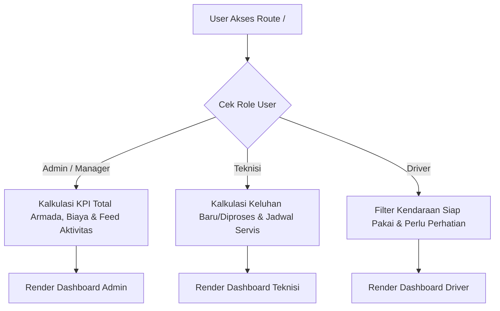
3. **Route yang Digunakan**: `GET /` (`dashboard`)
4. **Controller yang Menangani**: `App\Http\Controllers\DashboardController`
5. **Model & Tabel Database**: `Kendaraan`, `MaintenanceSchedule`, `KeluhanKendaraan`, `Pembayaran`, `ChecklistKendaraan`.
6. **Request Validation**: Otorisasi middleware `auth`.
7. **Response**: `ViewResponse` (`dashboard` / `dashboard-teknisi` / `dashboard-driver`).

---

### 3. Module Manajemen Armada (Kendaraan / Fleet Management)
1. **Tujuan Module**: Mengelola data fisik kendaraan, posisi pool, odometer (KM), foto armada, dan dokumen legalitas (STNK, Pajak, KIR).
2. **Alur Bisnis**: Admin Input Kendaraan ➔ Teknisi/Admin Update KM ➔ Sistem Evaluasi Indikator Warna (🟢 Safe, 🟡 Warning, 🔴 Overdue).
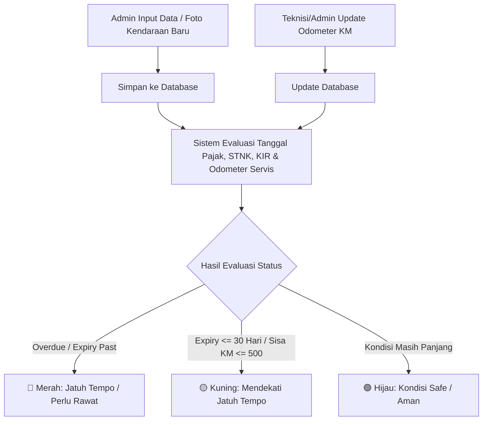
3. **Route yang Digunakan**: `GET/POST /kendaraan`, `PUT /kendaraan/{id}`, `PATCH /kendaraan/{id}/odometer`, `DELETE /kendaraan/{id}`
4. **Controller yang Menangani**: `App\Http\Controllers\KendaraanController`
5. **Model & Tabel Database**: `App\Models\Kendaraan` (Tabel `kendaraans`)
6. **Request Validation**: `nomor_polisi` (unique:kendaraans), `jenis_kendaraan` (Mobil/Motor), `foto_kendaraan` (max:3072).
7. **Response**: `ViewResponse` (`kendaraan.index`), `RedirectResponse` pesan flash.

---

### 4. Module Pre-Trip Inspection (Checklist Harian Kendaraan)
1. **Tujuan Module**: Memastikan kelayakan fisik armada sebelum dioperasikan via pengecekan 4 parameter harian.
2. **Alur Bisnis**: Driver/Teknisi Isi Form Checklist ➔ Pilih Status OK / Bermasalah ➔ Simpan Log ➔ Otomatis Picu Tiket Keluhan Jika Ada Masalah.
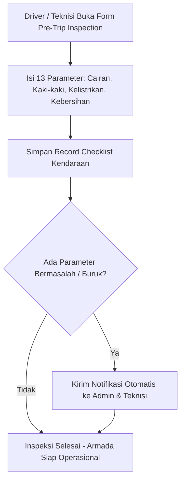
3. **Route yang Digunakan**: `GET /checklist/create`, `POST /checklist`
4. **Controller yang Menangani**: `App\Http\Controllers\ChecklistKendaraanController`
5. **Model & Tabel Database**: `ChecklistKendaraan` (`checklists`), `Kendaraan`, `KeluhanKendaraan`.
6. **Request Validation**: `kendaraan_id` (exists:kendaraans,id), `odometer` (numeric), `cairan_*`, `kaki_*`, `listrik_*`, `kebersihan_*`.
7. **Response**: `ViewResponse` (`checklist.create`), `RedirectResponse`.

---

### 5. Module Status Armada (Monitoring Status Operasional)
1. **Tujuan Module**: Menampilkan peta status kesiapan armada secara real-time (Ready, Servis, Rusak, Dipakai).
2. **Alur Bisnis**: Rekap Data Checklist Harian + Tiket Keluhan Pending + Jadwal Servis Aktif ➔ Sajikan Ringkasan Visual Status.
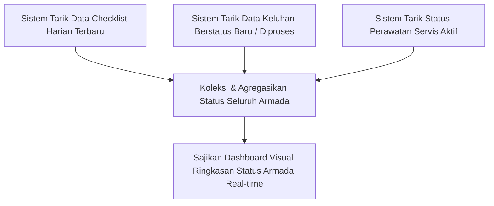
3. **Route yang Digunakan**: `GET /status-armada` (`status-armada.index`)
4. **Controller yang Menangani**: `App\Http\Controllers\StatusArmadaController`
5. **Model & Tabel Database**: `Kendaraan`, `ChecklistKendaraan`, `KeluhanKendaraan`.
6. **Request Validation**: Otorisasi middleware `auth`.
7. **Response**: `ViewResponse` (`status-armada.index`).

---

### 6. Module Jadwal & Riwayat Perawatan (Maintenance Schedule & Log)
1. **Tujuan Module**: Menentukan jadwal servis rutin komponen (Oli, Ban, Rem, Coolant) berdasarkan KM/Bulan dan mencatat riwayat perbaikan.
2. **Alur Bisnis**: Atur Jadwal & Interval Komponen ➔ Kalender Memetakan Penggantian ➔ Teknisi Klik "Catat Ganti" ➔ Odometer & Log Servis Terupdate.
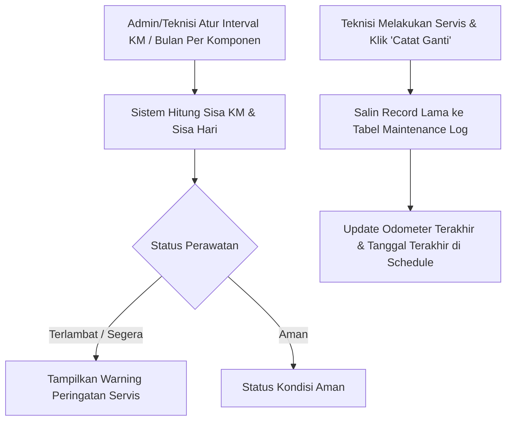
3. **Route yang Digunakan**: `GET/POST /jadwal-perawatan`, `PATCH /jadwal-perawatan/{id}`, `GET /jadwal-perawatan/riwayat`
4. **Controller yang Menangani**: `App\Http\Controllers\JadwalPerawatanController`
5. **Model & Tabel Database**: `MaintenanceSchedule` (`maintenance_schedules`), `MaintenanceLog` (`maintenance_logs`), `Kendaraan`.
6. **Request Validation**: `kendaraan_id` (required), `jenis_perawatan` (required), `interval_km` (numeric), `tanggal_terakhir` (date).
7. **Response**: `ViewResponse` (`jadwal-perawatan.index`, `jadwal-perawatan.riwayat`), `RedirectResponse`.

---

### 7. Module Laporan Keluhan Kendaraan (Issue Reporting)
1. **Tujuan Module**: Pelaporan fisik kendala armada oleh Driver/User dan pemantauan status perbaikan oleh Teknisi/Admin.
2. **Alur Bisnis**: Driver Buat Laporan & Upload Bukti ➔ Status `Baru` ➔ Teknisi Terima & Ubah ke `Diproses` ➔ Setelah Selesai Ubah ke `Selesai`.
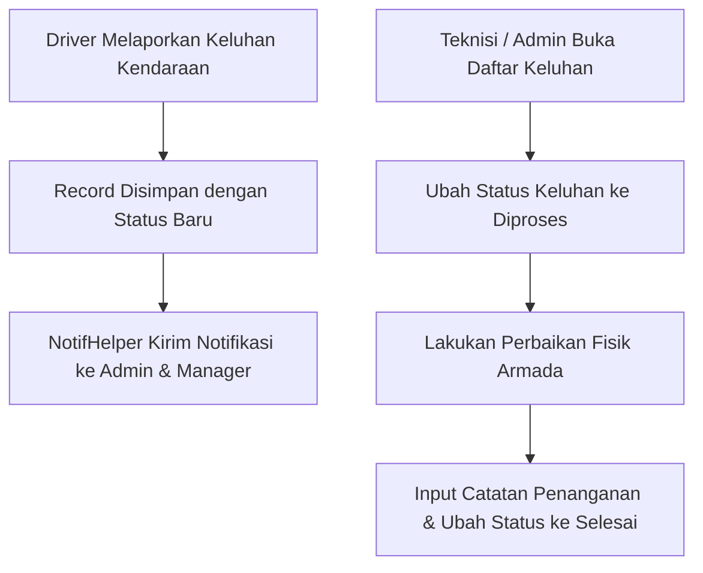
3. **Route yang Digunakan**: `GET/POST /keluhan-kendaraan`, `PATCH /keluhan-kendaraan/{id}`
4. **Controller yang Menangani**: `App\Http\Controllers\KeluhanKendaraanController`
5. **Model & Tabel Database**: `KeluhanKendaraan` (`keluhan_kendaraans`), `Kendaraan`, `User`.
6. **Request Validation**: `kendaraan_id` (required), `judul_keluhan` (required, max:255), `foto_keluhan` (image, max:3072).
7. **Response**: `ViewResponse` (`keluhan-kendaraan.index`), `RedirectResponse`.

---

### 8. Module Klaim Biaya Operasional (Expense Claim & Approval)
1. **Tujuan Module**: Pencatatan transaksi pengeluaran (BBM, Tol, Parkir, Servis Bengkel) dan alur persetujuan (*approval*) anggaran oleh Admin.
2. **Alur Bisnis**: User/Teknisi Input Klaim & Foto Struk ➔ Status `Pending` ➔ Admin Review ➔ Admin Klik `Approve` / `Reject` ➔ Terakumulasi ke Laporan.
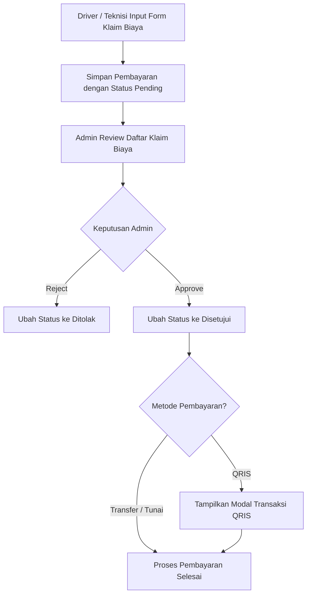
3. **Route yang Digunakan**: `GET/POST /pembayaran`, `POST /pembayaran/{id}/approve`, `POST /pembayaran/{id}/reject`
4. **Controller yang Menangani**: `App\Http\Controllers\PembayaranController`
5. **Model & Tabel Database**: `Pembayaran` (`pembayarans`), `Kendaraan`, `User`.
6. **Request Validation**: `kendaraan_id` (required), `kategori` (required), `jumlah_biaya` (numeric, min:1), `bukti_pembayaran` (image, max:3072).
7. **Response**: `ViewResponse` (`pembayaran.index`), `RedirectResponse`.

---

### 9. Module Manajemen Aset & Inventory (Barang / Spare Parts)
1. **Tujuan Module**: Mengelola stok barang inventaris, peralatan bengkel, dan suku cadang armada beserta status kondisinya.
2. **Alur Bisnis**: Catat Barang Baru ➔ Update Jumlah Stok & Status Kondisi (Baik / Perlu Diganti) ➔ Hapus/Arsipkan Barang.
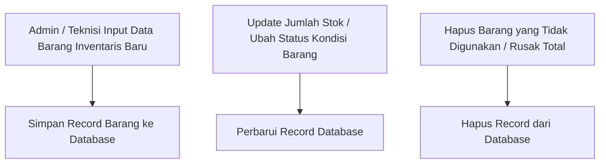
3. **Route yang Digunakan**: `GET/POST /barang`, `PATCH /barang/{id}/status`, `DELETE /barang/{id}`
4. **Controller yang Menangani**: `App\Http\Controllers\BarangController`
5. **Model & Tabel Database**: `Barang` (`barangs`).
6. **Request Validation**: `nama_barang` (required), `kode_barang` (unique:barangs), `jumlah` (numeric), `kondisi` (required).
7. **Response**: `ViewResponse` (`barang.index`), `RedirectResponse`.

---

### 10. Module Laporan & Analitik (Analytical Reports)
1. **Tujuan Module**: Analisis akhir bulan total pengeluaran biaya per armada, efisiensi BBM, serta analisis perbaikan termahal & tersering ke bengkel.
2. **Alur Bisnis**: Admin Pilih Periode Bulan/Tahun ➔ Controller Kalkulasi Agregasi Biaya ➔ Tampilkan Grafik Kendaraan Terboros BBM & Termahal Bengkel.
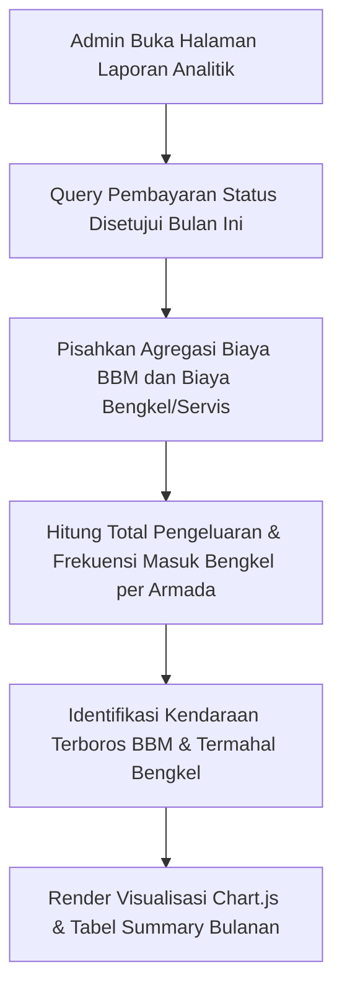
3. **Route yang Digunakan**: `GET /laporan-analitik` (`laporan.index`) [Role: Admin]
4. **Controller yang Menangani**: `App\Http\Controllers\LaporanController`
5. **Model & Tabel Database**: `Pembayaran`, `MaintenanceLog`, `Kendaraan`, `KeluhanKendaraan`.
6. **Request Validation**: `bulan` (numeric), `tahun` (numeric), `kendaraan_id` (nullable).
7. **Response**: `ViewResponse` (`laporan.index`).

---

### 11. Module Notifikasi Peringatan System (Notification Center)
1. **Tujuan Module**: Peringatan (*alert*) otomatis mengenai dokumen armada yang mendekati tenggat (STNK/Pajak/KIR) atau jadwal pemeliharaan yang jatuh tempo.
2. **Alur Bisnis**: System Engine Pindai Tanggal & KM ➔ Tampilkan Badge Jumlah Notifikasi di Navbar ➔ User Klik & Tandai Sudah Dibaca.
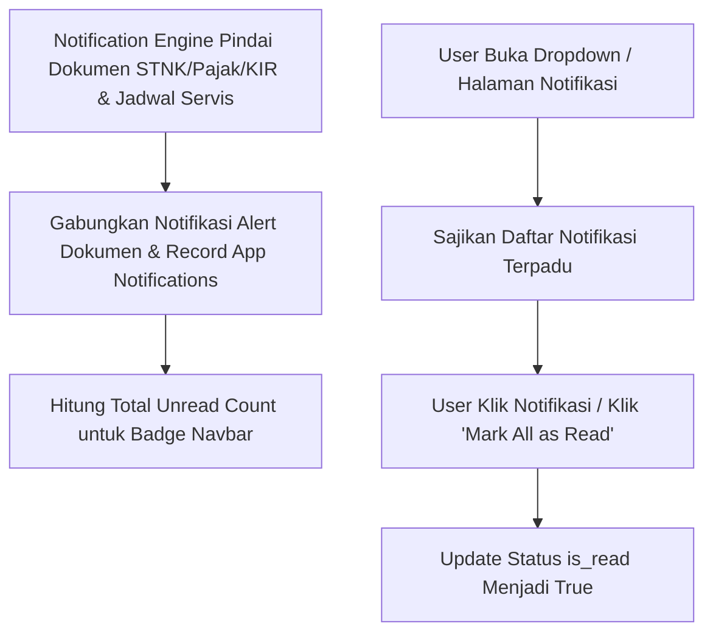
3. **Route yang Digunakan**: `GET /notifikasi`, `GET /notifikasi/count`, `POST /notifikasi/baca-semua`
4. **Controller yang Menangani**: `App\Http\Controllers\NotificationController`
5. **Model & Tabel Database**: `Notification` (`notifications`), `Kendaraan`, `MaintenanceSchedule`.
6. **Request Validation**: `id` notification (exists:notifications,id).
7. **Response**: `JsonResponse` (untuk badge navbar), `ViewResponse` (`notifikasi.index`).
