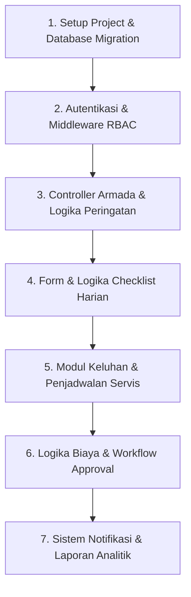

# 🛠️ ROADMAP CODING & PENGEMBANGAN PROGRAM DARI NOL
## Sistem Manajemen Perawatan Armada (Fleet Maintenance System - Laravel)

Dokumen ini disusun khusus sebagai **Panduan Coding & Alur Pengembangan dari Nol (Step-by-Step Development Roadmap)**. Panduan ini menuntun Anda menulis kode program, membuat struktur basis data, menangani otorisasi RBAC, hingga menyusun logika bisnis di Laravel.

---

## 🧭 PETA URUTAN KODING (DEVELOPMENT WORKFLOW)



---

## 🚀 TAHAP 1: SETUP PROYEK & STRUCTURE DATABASE (MIGRATION)

### 1. Inisialisasi Proyek Laravel
Jalankan perintah berikut di terminal:
```bash
composer create-project laravel/laravel manajemen_perawatan
cd manajemen_perawatan
```

### 2. Konfigurasi Database (`.env`)
Atur koneksi basis data pada file `.env`:
```ini
DB_CONNECTION=mysql
DB_HOST=127.0.0.1
DB_PORT=3306
DB_DATABASE=manajemen_perawatan
DB_USERNAME=root
DB_PASSWORD=
```

### 3. Membuat Database Migration & Model
Jalankan perintah Artisan untuk membuat tabel-tabel utama:
```bash
php artisan make:model Kendaraan -m
php artisan make:model ChecklistKendaraan -m
php artisan make:model KeluhanKendaraan -m
php artisan make:model MaintenanceSchedule -m
php artisan make:model MaintenanceLog -m
php artisan make:model Pembayaran -m
php artisan make:model Barang -m
php artisan make:model AppNotification -m
```

### 4. Menentukan Skema Database (Struktur Kolom Key)

#### a. Skema Tabel `users` (`database/migrations/xxxx_create_users_table.php`)
```php
Schema::create('users', function (Blueprint $table) {
    $table->id();
    $table->string('name');
    $table->string('email')->unique();
    $table->string('password');
    $table->enum('role', ['administrator', 'teknisi', 'driver', 'manager'])->default('driver');
    $table->string('phone_number')->nullable();
    $table->string('profile_photo')->nullable();
    $table->timestamps();
});
```

#### b. Skema Tabel `kendaraan`
```php
Schema::create('kendaraans', function (Blueprint $table) {
    $table->id();
    $table->string('no_plat')->unique();
    $table->string('merk');
    $table->string('tipe');
    $table->integer('tahun');
    $table->integer('km_saat_ini')->default(0);
    $table->date('tgl_stnk')->nullable();
    $table->date('tgl_kir')->nullable();
    $table->date('tgl_pajak')->nullable();
    $table->enum('status', ['siap_pakai', 'perlu_perhatian', 'dalam_perawatan']).default('siap_pakai');
    $table->timestamps();
});
```

#### c. Skema Tabel `checklist_kendaraans`
```php
Schema::create('checklist_kendaraans', function (Blueprint $table) {
    $table->id();
    $table->foreignId('kendaraan_id')->constrained('kendaraans')->onDelete('cascade');
    $table->foreignId('user_id')->constrained('users')->onDelete('cascade');
    $table->boolean('cairan_oli');
    $table->boolean('cairan_radiator');
    $table->boolean('cairan_rem');
    $table->boolean('cairan_wiper');
    $table->boolean('kaki_ban');
    $table->boolean('kaki_rem');
    $table->boolean('kelistrikan_lampu');
    $table->boolean('kebersihan');
    $table->boolean('layak_jalan');
    $table->text('catatan')->nullable();
    $table->timestamps();
});
```

#### d. Skema Tabel `pembayarans` (Klaim Biaya)
```php
Schema::create('pembayarans', function (Blueprint $table) {
    $table->id();
    $table->foreignId('user_id')->constrained('users');
    $table->foreignId('kendaraan_id')->nullable()->constrained('kendaraans');
    $table->string('jenis_biaya'); // BBM, Tol, Servis, Sparepart
    $table->decimal('nominal', 12, 2);
    $table->string('bukti_nota')->nullable();
    $table->enum('status', ['pending', 'approved', 'rejected'])->default('pending');
    $table->text('catatan_admin')->nullable();
    $table->timestamps();
});
```

---

## 🔒 TAHAP 2: OTENTIKASI & MIDDLEWARE MULTI-ROLE (RBAC)

### 1. Membuat Role Middleware Custom
Buat middleware otorisasi role dengan perintah:
```bash
php artisan make:middleware RoleMiddleware
```

Isi logika otorisasi pada [app/Http/Middleware/RoleMiddleware.php](file:///c:/xampp/htdocs/manajemen_perawatan/app/Http/Middleware/RoleMiddleware.php):
```php
namespace App\Http\Middleware;

use Closure;
use Illuminate\Http\Request;
use Illuminate\Support\Facades\Auth;

class RoleMiddleware
{
    public function handle(Request $request, Closure $next, ...$roles)
    {
        if (!Auth::check()) {
            return redirect()->route('login');
        }

        $user = Auth::user();
        if (in_array($user->role, $roles)) {
            return $next($request);
        }

        abort(403, 'Anda tidak memiliki hak akses ke halaman ini.');
    }
}
```

### 2. Mendaftarkan Route dengan Protected Role
Buka file [routes/web.php](file:///c:/xampp/htdocs/manajemen_perawatan/routes/web.php) dan buat struktur grup rute:
```php
Route::middleware(['auth'])->group(function () {
    // Rute Umum
    Route::get('/', [DashboardController::class, 'index'])->name('dashboard');

    // Rute Khusus Admin
    Route::middleware(['role:administrator'])->group(function () {
        Route::post('/kendaraan', [KendaraanController::class, 'store']);
        Route::post('/pembayaran/{id}/approve', [PembayaranController::class, 'approve']);
        Route::get('/laporan-analitik', [LaporanController::class, 'index']);
    });

    // Rute Admin & Teknisi
    Route::middleware(['role:administrator,teknisi'])->group(function () {
        Route::post('/jadwal-perawatan', [JadwalPerawatanController::class, 'store']);
        Route::patch('/kendaraan/{id}/odometer', [KendaraanController::class, 'updateOdometer']);
    });
});
```

---

## 🚘 TAHAP 3: KODING MANAJEMEN ARMADA & INDIKATOR WARNA

### 1. Membuat Controller Kendaraan
```bash
php artisan make:controller KendaraanController
```

### 2. Logika Hitung Indikator Peringatan (STNK / KIR / KM Servis)
Tambahkan method pendukung di [KendaraanController.php](file:///c:/xampp/htdocs/manajemen_perawatan/app/Http/Controllers/KendaraanController.php) atau Model [Kendaraan.php](file:///c:/xampp/htdocs/manajemen_perawatan/app/Models/Kendaraan.php):
```php
public function getStatusPeringatanAttribute()
{
    $hariJatuhTempoSTNK = now()->diffInDays($this->tgl_stnk, false);
    
    if ($hariJatuhTempoSTNK < 0) {
        return ['warna' => 'red', 'label' => 'STNK Expired!'];
    } elseif ($hariJatuhTempoSTNK <= 30) {
        return ['warna' => 'yellow', 'label' => 'STNK Segera Jatuh Tempo'];
    }
    
    return ['warna' => 'green', 'label' => 'Normal'];
}
```

---

## 📋 TAHAP 4: KODING FORM & LOGIKA INSPEKSI HARIAN (CHECKLIST)

### 1. Form Input Inspeksi Harian
Buat controller [ChecklistKendaraanController.php](file:///c:/xampp/htdocs/manajemen_perawatan/app/Http/Controllers/ChecklistKendaraanController.php):
```php
public function store(Request $request)
{
    $validated = $request->validate([
        'kendaraan_id' => 'required|exists:kendaraans,id',
        'cairan_oli' => 'required|boolean',
        'cairan_radiator' => 'required|boolean',
        'cairan_rem' => 'required|boolean',
        'cairan_wiper' => 'required|boolean',
        'kaki_ban' => 'required|boolean',
        'kaki_rem' => 'required|boolean',
        'kelistrikan_lampu' => 'required|boolean',
        'kebersihan' => 'required|boolean',
        'catatan' => 'nullable|string'
    ]);

    // Hitung apakah layak jalan
    $layakJalan = $validated['cairan_oli'] && $validated['cairan_radiator'] 
               && $validated['cairan_rem'] && $validated['kaki_rem'] 
               && $validated['kelistrikan_lampu'];

    $validated['user_id'] = auth()->id();
    $validated['layak_jalan'] = $layakJalan;

    $checklist = ChecklistKendaraan::create($validated);

    // Jika tidak layak jalan, ubah status kendaraan secara otomatis
    if (!$layakJalan) {
        $kendaraan = Kendaraan::find($request->kendaraan_id);
        $kendaraan->update(['status' => 'perlu_perhatian']);
    }

    return redirect()->route('dashboard')->with('success', 'Checklist harian berhasil disimpan!');
}
```

---

## 🔧 TAHAP 5: KODING LOGIKA KELUHAN & JADWAL PERAWATAN (SERVIS)

### 1. Pelaporan Keluhan Kerusakan
Pada [KeluhanKendaraanController.php](file:///c:/xampp/htdocs/manajemen_perawatan/app/Http/Controllers/KeluhanKendaraanController.php):
- Driver mengirim laporan kerusakan (`status = pending`).
- Teknisi menerima daftar keluhan, lalu mengubah status menjadi `diproses` saat memulai perbaikan.
- Setelah selesai, teknisi mengubah status menjadi `selesai` dan sistem mencatat log perawatan di [MaintenanceLog.php](file:///c:/xampp/htdocs/manajemen_perawatan/app/Models/MaintenanceLog.php).

---

## 💳 TAHAP 6: KODING KLAIM BIAYA OPERASIONAL & WORKFLOW APPROVAL

### 1. Controller Pembayaran / Klaim Biaya
Buka [PembayaranController.php](file:///c:/xampp/htdocs/manajemen_perawatan/app/Http/Controllers/PembayaranController.php):

```php
// User/Driver mengajukan klaim
public function store(Request $request)
{
    $request->validate([
        'jenis_biaya' => 'required|string',
        'nominal' => 'required|numeric|min:1000',
        'bukti_nota' => 'required|image|max:2048'
    ]);

    $pathNota = $request->file('bukti_nota')->store('bukti_nota', 'public');

    Pembayaran::create([
        'user_id' => auth()->id(),
        'kendaraan_id' => $request->kendaraan_id,
        'jenis_biaya' => $request->jenis_biaya,
        'nominal' => $request->nominal,
        'bukti_nota' => $pathNota,
        'status' => 'pending'
    ]);

    return back()->with('success', 'Klaim biaya berhasil diajukan!');
}

// Admin menyetujui klaim
public function approve($id)
{
    $pembayaran = Pembayaran::findOrFail($id);
    $pembayaran->update(['status' => 'approved']);

    return back()->with('success', 'Klaim biaya disetujui.');
}
```

---

## 🔔 TAHAP 7: NOTIFIKASI OTOMATIS & LAPORAN ANALITIK

### 1. Logika Notifikasi Peringatan (Alert Notification)
Pada [NotificationController.php](file:///c:/xampp/htdocs/manajemen_perawatan/app/Http/Controllers/NotificationController.php):
- Buat query pemicu (*trigger*) yang memeriksa tanggal kedaluwarsa dokumen dan KM odometer secara berkala.
- Simpan notifikasi ke tabel `app_notifications` untuk ditampilkan pada bell header UI.

### 2. Logika Laporan Rekap & Grafik Analitik
Pada [LaporanController.php](file:///c:/xampp/htdocs/manajemen_perawatan/app/Http/Controllers/LaporanController.php):
- Gunakan query agregasi Eloquent (`DB::raw`, `groupBy`, `sum('nominal')`) untuk menghasilkan laporan bulanan total pengeluaran per kendaraan.

---

## 📌 DAFTAR FILE UTAMA DALAM CODEBASE PROYEK INI
Buka dan pelajari kode lengkap yang sudah ada di lokasi file berikut:
- **Routes & Middleware**: [routes/web.php](file:///c:/xampp/htdocs/manajemen_perawatan/routes/web.php)
- **Controller Dashboard**: [app/Http/Controllers/DashboardController.php](file:///c:/xampp/htdocs/manajemen_perawatan/app/Http/Controllers/DashboardController.php)
- **Controller Armada**: [app/Http/Controllers/KendaraanController.php](file:///c:/xampp/htdocs/manajemen_perawatan/app/Http/Controllers/KendaraanController.php)
- **Controller Inspeksi**: [app/Http/Controllers/ChecklistKendaraanController.php](file:///c:/xampp/htdocs/manajemen_perawatan/app/Http/Controllers/ChecklistKendaraanController.php)
- **Controller Servis**: [app/Http/Controllers/JadwalPerawatanController.php](file:///c:/xampp/htdocs/manajemen_perawatan/app/Http/Controllers/JadwalPerawatanController.php)
- **Controller Klaim Biaya**: [app/Http/Controllers/PembayaranController.php](file:///c:/xampp/htdocs/manajemen_perawatan/app/Http/Controllers/PembayaranController.php)
